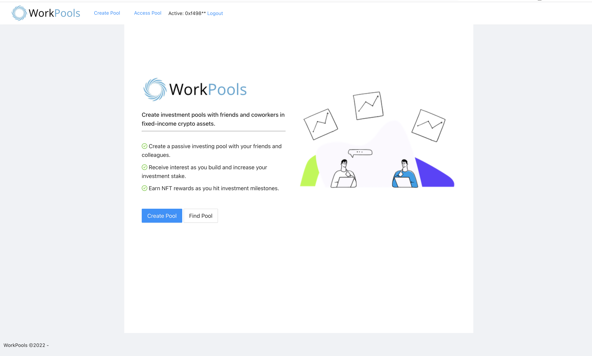

 

    

 

WorkPools
---

Invest in passive yielding liquidity pools with your friends and colleagues. Earn badges as you reach investment milestones.

Pitch Deck: https://docs.google.com/presentation/d/1DpN8Aos2-_2VMGf9A4Bu4mOEFnyeR_77Zr2KYqiQFuo/edit?usp=sharing

<b>Note this project is a hackathon proof of concept and would require additional work in order to be production ready</b>

### Motivation

It's common to create small crypto social groups at work, but often that's where it ends. With WorkPools, you can set up custom investment pools with your friends and strategize the best ways to earn return on your crypto assets - without assuming the generally high volatility and risk associated with active trading.

WorkPools reduces intimidation by creating a group space for coworkers/friends to learn about yield pools and invest together.

<!--
Demo flow:

-->

### How it works:

1. Login with web3 provider
2. Select company, worldcoin verifies if a single transaction was made by this individual for this company, or if the pool already exists.
3. Create the pool / invite others by sharing a unique link to the pool. 
4. View investment progress from the WorkPool dashboard.
5. Communicate with other individuals in the group and select passive investments.
6. Monitor your progress and unlock NFT rewards as your group reaches key investment progress markers (1k, 5k, 10k).

### Technologies used:

#### Authentication/ Deployment
* WorldCoin: Validate the user accessing/creating the pool. Prevent the same user from creating duplicate pools that belong to the same organization.
* WalletConnect: https://docs.walletconnect.com/quick-start/dapps/web3-provider. Walletconnect enables usage of the WorkPool app from any supported wallet with a QR code scanner.
* Polygon: Low cost contract deployment for each WorkPool smart contract. Code is privately stored on the contract and used for work pool access - only the owner can fetch the active code value.

#### Rewards
* Filecoin: Earn NFT rewards as you hit key investment milestones with your group.
* Aave: Embeded on the dashboard - initiate deposits and withdrawls from your WorkPool. 
* Tempus: Secondary ethereum-based fixed-income provider. Tempus portal embedded in the app dashboard (currently testnet).

#### Experience
* Waku: Used for in-app chat, messaging obfuscated by the address.
* Spheron: Deployment

Also uses clearbit for company logo fetch.

### How to run

Define the following environment variables:
<pre>
    REACT_APP_NFT_KEY={YOUR NFT STORAGE KEY} // Used for NFT generation
    REACT_APP_RPC_URL={YOUR RPC NODE URL} // Mumbai test net RPC url (ex: Infura, Alchemy)
    // Optional (for persistent non-IFPS storage)
    REACT_APP_MORALIS_ID={YOUR_MORALIS_APP_ID} # Moralis app id 
    REACT_APP_MORALIS_SERVER={YOUR_MORALIS_SERVER_URL} # Moralis server url
</pre>

App is currently configured to run against Polygon / Mumbai. Recommend adding your own mumbai-based RPC url (ex: Alchemy/Infura) in order to serve the application.

`yarn; yarn start`

The app should now be running on port http://127.0.0.1:3000.

<b>Important, you should use http://127.0.0.1 for local development to connect to moralis RPC (otherwise may result in CORS errors).</b>

## Screenshots

### Home page

### Creating a new WorkPool

<!-- ### WorkPool created 
 -->

### WorkPool dashboard / investment management

### Updating the WorkPool smart contract

Make any changes to `WorkPool.sol` in the `contracts` directory.

`cd contracts; yarn; npx hardhat compile`

### Useful links
*  https://nft.storage/
* https://docs.walletconnect.com/quick-start/dapps/web3-provider
* https://docs.chainstack.com/quickstart/create-a-project
* https://ethglobal.notion.site/HackMoney-Info-Center-294c61659a7e48da926cca8d0d40588b
* https://showcase.ethglobal.com/hackmoney2022/prizes
* https://hackmd.io/@hackyguru/walletconnect
* https://hardhat.org/tutorial/creating-a-new-hardhat-project.html
* https://v2-docs.zksync.io/dev/guide/hello-world.html#prerequisites
* https://v2-docs.zksync.io/dev/guide/hello-world.html#working-with-provider

